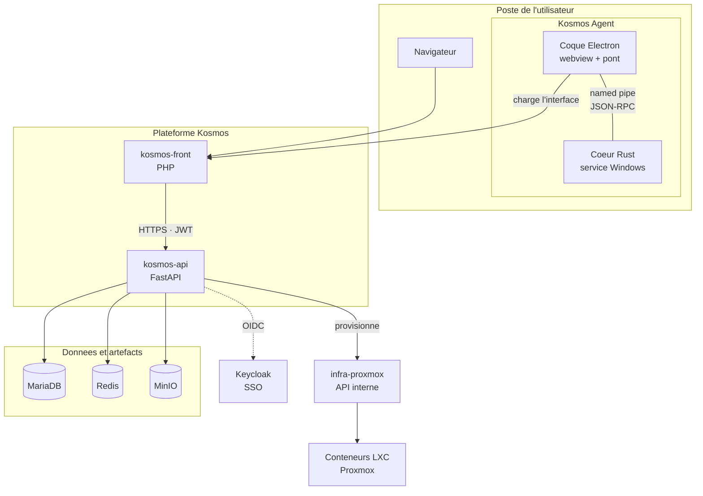

# Kosmos

Kosmos est une plateforme de provisionnement d'infrastructure développée par **Kopo**. Elle permet de créer et gérer des environnements isolés à la demande : serveurs de jeu, environnements de test ou d'entraînement en cybersécurité (red team / blue team), ou environnements applicatifs éphémères.

Un utilisateur ouvre un espace de travail — un **space** —, y crée des serveurs en quelques clics, et installe des packs de mods sur sa propre machine via une application de bureau. Toute l'infrastructure sous-jacente est provisionnée automatiquement.

---

## Dépôts de l'écosystème

| Dépôt | Rôle |
|---|---|
| [kosmos-front](https://git.kopo/Kopo/kosmos-front) | Interface web — sert aussi d'interface à l'application de bureau |
| [kosmos-api](https://git.kopo/Kopo/kosmos-api) | Backend : authentification, logique métier, orchestration |
| [kosmos-agent](https://git.kopo/Kopo/kosmos-agent) | Application de bureau : cœur Rust + coque Electron |
| [infra-proxmox](https://git.kopo/Kopo/infra-proxmox) | Couche d'infrastructure Kopo — provisionne les environnements |

`infra-proxmox` sert l'ensemble des services Kopo et n'est pas exclusif à Kosmos.

---

## Architecture

**kosmos-front** est l'interface web. Elle ne touche aucune base de données : tout passe par kosmos-api, et le jeton de session reste côté serveur, jamais exposé au navigateur.

**kosmos-api** centralise l'authentification, la logique métier et la persistance. Il orchestre les demandes de provisionnement vers la couche d'infrastructure.

**kosmos-agent** est l'application de bureau. Sa coque Electron charge l'interface web dans une webview et y injecte un pont ; le cœur Rust, installé en service Windows, exécute les opérations locales. Les deux dialoguent par un **named pipe** — le cœur n'ouvre aucun port réseau et ne contacte jamais l'API directement.

---

## Ce que fait la plateforme

<!--
  CAPTURE D'ÉCRAN À REFAIRE ICI (tableau de bord d'un space).

  L'ancienne, retirée le 2026-08-01, montrait une interface qui n'existe plus :
  carte « VPN », action rapide « Gérer VPN » et ligne « Réseau VPN » dans l'état
  système, alors que le VPN a été entièrement retiré du produit. Le fond illustré
  ne correspond plus non plus à la charte actuelle.

  Elle était par ailleurs hébergée sur le CDN de GitHub
  (github.com/user-attachments/...), dépendance externe à un compte qu'on
  n'utilise plus. La remplaçante doit être COMMITÉE DANS CE DÉPÔT, par exemple
  sous `images/`, et référencée en chemin relatif.

  Attention : ce dépôt est PUBLIC. Utiliser un jeu de données de démonstration,
  pas un space réel (pas de noms d'utilisateurs ni de serveurs de production).
-->

### Spaces et serveurs de jeu

Un space regroupe une équipe, ses serveurs et ses packs. On y crée un serveur en choisissant un jeu ; le conteneur est provisionné, démarré, arrêté ou supprimé depuis l'interface. Les rôles déterminent qui peut faire quoi.

### Packs de mods

Une bibliothèque de packs, alimentée par les membres et modérée par les responsables de space. L'installation et le lancement se font par l'application de bureau : elle télécharge les artefacts, vérifie leur intégrité, monte l'instance dans un dossier isolé et lance le jeu modé — sans toucher à l'installation d'origine.

### Comptes et accès

Authentification par mot de passe ou **SSO** (OpenID Connect, via un broker Keycloak). Les sessions sont révocables individuellement. Une console d'administration transverse permet de superviser l'ensemble de la plateforme.

### Mises à jour de l'agent

L'application de bureau se met à jour toute seule, et **chaque mise à jour est signée** : une chaîne Ed25519 relie une clé racine compilée dans l'application au manifeste de la version publiée. Une mise à jour qui n'est pas signée par Kopo est refusée.

---

## Technologies

| Composant | Technologies |
|---|---|
| Interface web | PHP 8.3 (MVC maison), JavaScript |
| Application de bureau | Rust (cœur, service Windows), Electron + TypeScript (coque) |
| API backend | Python 3.13, FastAPI, MariaDB, Redis, MinIO |
| Authentification | JWT, Argon2, OpenID Connect (Keycloak) |
| Infrastructure | Proxmox (LXC), Python, Nginx |

L'application de bureau est distribuée pour **Windows x64**.

---

## Licence

Propriétaire — Kopo® 2026
